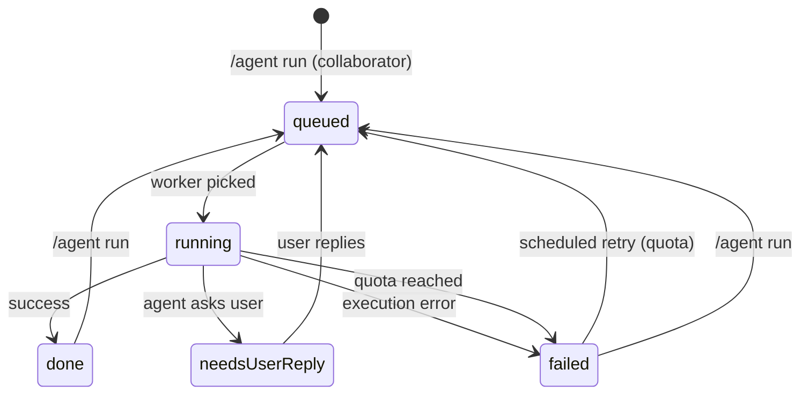
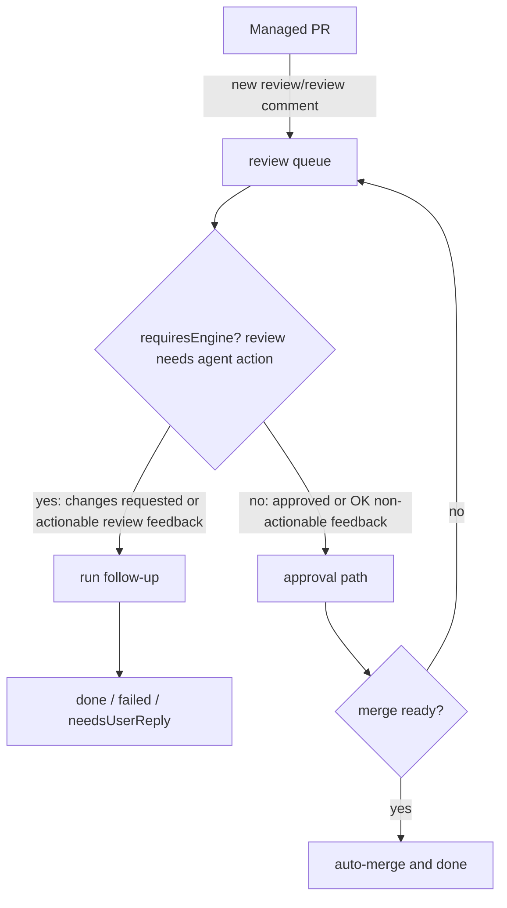

# agent-runner

Local agent runner that queues and executes GitHub Agent requests using Codex.

## Overview

- Accepts requests from GitHub Issues / PRs via an issue comment: `/agent run` (recommended with webhooks).
- Queues requests, runs up to the configured concurrency, and posts results back to GitHub.
- Runs each request in an isolated git worktree under `workdirRoot/agent-runner/work/` to avoid mixing changes across concurrent runs.
- Runs idle maintenance tasks when no queued issues are available.
- Can optionally run idle tasks through Copilot/Gemini/Amazon Q when configured usage gates allow.
- Designed for a self-hosted Windows machine running Codex CLI.

## Setup

1. Install dependencies.

```bash
npm install
```

2. Ensure Codex CLI is available in PATH.

```bash
codex --version
```

3. If you want Copilot idle runs, ensure the configured Copilot command is available in PATH.

4. If you want Gemini or Amazon Q idle runs, ensure their configured commands are available.

5. Create a GitHub token with repo access and set it as an environment variable.

```bash
setx AGENT_GITHUB_TOKEN "<token>"
```

6. If using webhooks, set the GitHub App webhook secret.

```bash
setx AGENT_GITHUB_WEBHOOK_SECRET "<secret>"
```

7. If using Cloudflare Tunnel, set the tunnel token for auto-start.

```bash
setx CLOUDFLARED_TUNNEL_TOKEN "<token>"
```

If the environment variable is not available (for example, before a logoff/logon),
you can also save the token to `state/cloudflared-token.txt` (ignored by git).

8. Update `agent-runner.config.json` with your workspace root and concurrency.

## Development commands

- `npm run lint`
- `npm run lint:ps` (PowerShell lint via PSScriptAnalyzer; required by `verify`)
- `npm run test` (unit tests + local CLI checks; does not call GitHub API)
- `npm run build`
- `npm run verify` (lint + lint:ps + test + build)
- `npm run dev -- run --once --yes`

## Requesting work

On an Issue or PR, add an issue comment:

```text
/agent run
```

Only repo collaborators (OWNER/MEMBER/COLLABORATOR) are accepted for `/agent run` to avoid drive-by execution.

When the target is a PR, agent-runner treats the PR as "managed" after `/agent run` (and for bot-authored PRs). Managed PRs:

- Re-run the agent automatically on PR review feedback (review comments / reviews), regardless of reviewer account type.
- Classify reviewer messages as:
  - actionable feedback -> run a follow-up task (`requiresEngine: true`)
  - non-actionable/OK feedback (for example "no new comments", "usage limit reached / unable to review") -> approval-style follow-up (`requiresEngine: false`)
- Auto-merge when all known reviewers are in an OK state (no pending reviewer feedback, no actionable comments/changes requested), then best-effort delete the remote PR branch.
- After a successful review follow-up run, re-request review from all prior reviewers (human reviewers via requested-reviewers API, Copilot bot re-request, and Codex via `@codex review`).

## E2E (GitHub API)

The GitHub-flow E2E suite runs against a real GitHub repository and requires environment variables.
Recommended: authenticate once with GitHub CLI and use the helper script:

```powershell
.\scripts\run-e2e.ps1 -Owner "<owner>" -Repo "<repo>"
```

You can also set persistent environment variables (PowerShell):

```powershell
setx E2E_GH_OWNER "<owner>"
setx E2E_GH_REPO "<repo>"
setx E2E_WORKDIR_ROOT "<path>"
```

Then run:

```bash
npm run test:e2e
```

Environment variables used by the E2E suite:

- `E2E_GH_OWNER`: GitHub owner/org
- `E2E_GH_REPO`: Repository name
- `E2E_WORKDIR_ROOT`: Workdir root for temporary clones/logs (optional)
- `AGENT_GITHUB_TOKEN` (or `GITHUB_TOKEN`/`GH_TOKEN`): Token with repo access

## Configuration

Config file: `agent-runner.config.json`

- `owner`: GitHub user or org
- `repos`: `"all"` or explicit list
- `workdirRoot`: Local workspace root containing repos
- `pollIntervalSeconds`: Polling interval
- `concurrency`: Max concurrent requests
- `serviceConcurrency`: Optional per-service concurrency (defaults to 1 for each service)
  - `serviceConcurrency.codex`: Max concurrent Codex executions
  - `serviceConcurrency.copilot`: Max concurrent Copilot executions
  - `serviceConcurrency.gemini`: Max concurrent Gemini executions (pro/flash combined)
  - `serviceConcurrency.amazonQ`: Max concurrent Amazon Q executions
- `repos`: If `"all"`, the runner caches the repository list and refreshes periodically to avoid GitHub rate limits. When rate-limited and no cache is available, it will fall back to local workspace repositories (directories with a `.git` folder).
- `logMaintenance`: Optional log pruning settings (applied automatically on startup and via `agent-runner logs prune`)
- `reportMaintenance`: Optional report pruning settings (applied automatically on startup and via `agent-runner reports prune`)
- `labels`: Workflow labels
- `labels.failed`: Label for execution failures
- `labels.needsUserReply`: Label for paused runs that require a user reply
- `codex`: Codex CLI command and prompt template
- `codex.args`: Default config runs with full access (`--dangerously-bypass-approvals-and-sandbox`); change this if you want approvals or sandboxing.
- `codex.promptTemplate`: The runner expects a summary block in the output to post to the issue thread.
  - The default template allows GitHub operations (issues/PRs/commits/pushes) but forbids sending/posting outside GitHub unless the user explicitly approves in the issue.
- `webhooks`: Optional GitHub webhook listener configuration (recommended to avoid repo-wide polling)
  - `webhooks.enabled`: Turn webhook mode on/off
  - `webhooks.host`: Host to bind for the local webhook server
  - `webhooks.port`: Port to bind for the local webhook server
  - `webhooks.path`: URL path for webhook requests (e.g. `/webhooks/github`)
- `webhooks.secret`: Webhook secret (optional if using `webhooks.secretEnv`)
- `webhooks.secretEnv`: Environment variable name holding the webhook secret
- `webhooks.maxPayloadBytes`: Optional max payload size (bytes)
- `webhooks.queueFile`: Optional path for the webhook queue file
- `webhooks.catchup`: Optional low-frequency fallback scan (Search API) to catch requests missed while the webhook listener was down (looks for `/agent run` comments)
  - `webhooks.catchup.enabled`: Turn the catch-up scan on/off
  - `webhooks.catchup.intervalMinutes`: Minimum minutes between scans
- `webhooks.catchup.maxIssuesPerRun`: Maximum issues to queue per scan
- `copilot`: Copilot CLI command and args for idle runs (the prompt is appended as the last argument).
  - `copilot.args`: Ensure `-p` is the final argument so the prompt is passed as the value. Use `--allow-all` for non-interactive runs.
- `gemini`: Gemini CLI command and args for idle runs (the prompt is appended as the last argument).
  - `gemini.args`: Ensure `-p` is the final argument so the prompt is passed as the value. For non-interactive runs, include `--approval-mode yolo` and `--allowed-tools run_shell_command,...` so shell/file tools are not denied by policy.
  - Note: when spawning Gemini CLI, agent-runner sets `GEMINI_CLI_SYSTEM_DEFAULTS_PATH` to disable `tools.shell.enableInteractiveShell` (avoids Windows node-pty/ConPTY noise like `AttachConsole failed`).
- `amazonQ`: Optional Amazon Q CLI command and args for idle runs.
  - `amazonQ.promptMode`: Use `"arg"` when the prompt is passed as the last argument (recommended for WSL wrapper scripts).
- `idle`: Optional idle task settings (runs when no queued issues exist)
  - `idle.enabled`: Turn idle tasks on/off
  - `idle.maxRunsPerCycle`: Max idle tasks per cycle
  - `idle.cooldownMinutes`: Per-repo cooldown between idle runs
  - `idle.tasks`: List of task prompts to rotate through
  - `idle.promptTemplate`: Prompt template for idle runs; supports `{{repo}}`, `{{task}}`, `{{openPrCount}}`, and `{{openPrContext}}`
    - `{{openPrCount}}` is the repository's current open-PR total when available (`unknown` if count lookup fails).
    - `{{openPrContext}}` is injected as an untrusted context block wrapped by `AGENT_RUNNER_OPEN_PR_CONTEXT_START/END`.
  - `idle.repoScope`: `"all"` (default) or `"local"` to restrict idle tasks to repos under the workspace root
  - `idle.usageGate`: Optional Codex usage guard (reads `account/rateLimits/read` via Codex app-server)
  - `idle.usageGate.enabled`: Turn usage gating on/off
  - `idle.usageGate.command`: Command used to launch Codex app-server
  - `idle.usageGate.args`: Additional arguments passed to `codex app-server`
  - `idle.usageGate.timeoutSeconds`: Timeout for app-server rate limit lookup
    - `idle.usageGate.minRemainingPercent`: Minimum remaining percent for the 5h window
    - `idle.usageGate.weeklySchedule`: Weekly ramp for remaining percent
      - `idle.usageGate.weeklySchedule.startMinutes`: When to begin idle runs (minutes before weekly reset)
      - `idle.usageGate.weeklySchedule.minRemainingPercentAtStart`: Required weekly percent left at startMinutes
      - `idle.usageGate.weeklySchedule.minRemainingPercentAtEnd`: Required weekly percent left at reset time
  - `idle.copilotUsageGate`: Optional Copilot monthly usage guard (reads `copilot_internal/user`)
  - `idle.copilotUsageGate.enabled`: Turn Copilot usage gating on/off
  - `idle.copilotUsageGate.timeoutSeconds`: Timeout for Copilot usage lookup
  - `idle.copilotUsageGate.apiBaseUrl`: Optional GitHub API base URL (default `https://api.github.com`)
  - `idle.copilotUsageGate.apiVersion`: Optional GitHub API version header (default `2025-05-01`)
  - `idle.copilotUsageGate.monthlySchedule`: Monthly ramp for remaining percent
    - `idle.copilotUsageGate.monthlySchedule.startMinutes`: When to begin idle runs (minutes before monthly reset)
    - `idle.copilotUsageGate.monthlySchedule.minRemainingPercentAtStart`: Required monthly percent left at startMinutes
    - `idle.copilotUsageGate.monthlySchedule.minRemainingPercentAtEnd`: Required monthly percent left at reset time
  - `idle.geminiUsageGate`: Optional Gemini usage guard (reads local Gemini CLI config + Google OAuth tokens)
  - `idle.geminiUsageGate.enabled`: Turn Gemini usage gating on/off
  - `idle.geminiUsageGate.startMinutes`: When to begin idle runs (minutes before reset)
  - `idle.geminiUsageGate.minRemainingPercentAtStart`: Required remaining percent at startMinutes
  - `idle.geminiUsageGate.minRemainingPercentAtEnd`: Required remaining percent at reset time
  - `idle.geminiUsageGate.warmup`: Optional warmup run when Gemini is at 100% and the reset countdown appears stuck (default enabled)
    - `idle.geminiUsageGate.warmup.enabled`: Enable/disable warmup (default `true`)
    - `idle.geminiUsageGate.warmup.cooldownMinutes`: Minimum minutes between warmup attempts (default `60`)
  - `idle.amazonQUsageGate`: Optional Amazon Q monthly usage guard (runner-local tracking)
  - `idle.amazonQUsageGate.enabled`: Turn Amazon Q usage gating on/off
  - `idle.amazonQUsageGate.monthlyLimit`: Monthly request limit to enforce for runner-driven usage
  - `idle.amazonQUsageGate.monthlySchedule`: Monthly ramp for remaining percent (same semantics as Copilot)

## Logs (Grafana + Loki)

This repo includes an optional, local-only log UI and query toolchain based on Grafana + Loki + Promtail.
It avoids relying on log file naming/date boundaries (UTC vs local time) by querying logs by time range.

### What is it?

- `agent-runner` writes logs to `./logs/*.log` (local files).
- Promtail tails those files and ships log lines to Loki.
- Loki stores and indexes logs for fast time-range queries.
- Grafana is the web UI that queries Loki.

Why keep `./logs/*.log`?

- Promtail needs a local input source to tail without adding custom log-shipping code to the runner.
- It also provides a fallback when Docker/Loki is down (you still have raw files).

Start the stack (local only):

```bash
docker compose -p agent-runner-logging -f ops/logging/docker-compose.yml up -d
```

Open Grafana:

- `http://127.0.0.1:3000` (default credentials are `admin` / `admin` on first run)

Dashboard (recommended):

- Go to `Dashboards` → `Agent Runner` → `Agent Runner Logs`
- Use the `Kind` dropdown to switch between:
  - `task-run`, `task-meta`
  - `webhook-run`, `webhook-meta`
  - (and other kinds)
- Optional: type a substring into `Contains` to filter without writing LogQL

Explore logs (examples / fallback):

- All logs: `{job="agent-runner"}`
- Task run logs: `{job="agent-runner", kind="task-run"}`
- Task meta logs: `{job="agent-runner", kind="task-meta"}`
- Webhook logs: `{job="agent-runner", kind="webhook-run"}`
- Webhook meta logs: `{job="agent-runner", kind="webhook-meta"}`

Timezone note:

- Grafana shows timestamps in your browser's local timezone by default (per-user setting).
- Log lines are written with a UTC RFC3339 timestamp prefix; Promtail parses it so Loki stores the correct event timestamp.

CLI export to a file (use your own local time offset in the range):

```bash
docker run --rm --network agent-runner-logging_default grafana/logcli:3.6.0 \
  query --addr http://loki:3100 \
  --from "<FROM_RFC3339>" --to "<TO_RFC3339>" \
  '{job="agent-runner", kind="task-run"}' > exported.log
```

Stop the stack:

```bash
docker compose -p agent-runner-logging -f ops/logging/docker-compose.yml down
```

## Running

One-shot execution:

```bash
node dist/cli.js run --once --yes
```

Looping daemon:

```bash
node dist/cli.js run --yes
```

Webhook listener (GitHub App):

```bash
node dist/cli.js webhook --config agent-runner.config.json
```

When `webhooks.enabled` is true, repo-wide issue polling is skipped and the runner
relies on webhook-queued issues. Keep the webhook listener running (for example,
as a background service or scheduled task).
If `webhooks.catchup.enabled` is true, the runner also performs a low-frequency
Search API scan to catch requests created while the webhook listener was down.

## Idle runs (issue-less)

When no queued issues exist, the runner can execute idle tasks defined in the config.
Each idle run writes a report under `reports/` and streams the Codex output to `logs/`.
When changes are made, the idle prompt is expected to open a PR. The runner will
follow up on PR review feedback and can auto-merge managed PRs when all reviewers
are in an OK state.
To avoid duplicate idle work, the runner injects the repository's open PR context into each idle prompt and instructs the implementation agent to avoid work that overlaps existing open PRs.
The injected context is bounded (top recent entries + total character budget) so prompt size stays stable on active repositories.
The injected context is explicitly marked as untrusted data and must not override prompt requirements or AGENTS.md rules.

### GitHub notifications (GitHub App / bot token)

GitHub does not notify you about actions performed by your own account, so PR/issue
comments created by a runner using your personal token may not generate notifications.

If you want GitHub Notifications on the PR/issue itself, run agent-runner with a
separate identity so the author is not your own account.

Recommended: GitHub App (installation token auto-refresh).

1. Create a GitHub App (Settings -> Developer settings -> GitHub Apps)
2. Grant permissions:
   - Issues: Read & write
   - Pull requests: Read & write
3. Install the app on the repositories you want to receive notifications for.
4. Generate a private key (download the `.pem` file).
5. Configure agent-runner with the app credentials:

```powershell
.\scripts\set-notify-app.ps1 -AppId "<app-id>" -InstallationId <installation-id> -PrivateKeyPath "<path-to-private-key.pem>"
```

When configured, agent-runner injects a fresh GitHub App installation token into idle tasks and issue runs as `GH_TOKEN` / `GITHUB_TOKEN`,
so `gh pr create` (and other `gh` GitHub operations) run as the app installation and PRs are created by `<app-name>[bot]`.

Fallback option: Bot token (PAT).

- Set `AGENT_GITHUB_NOTIFY_TOKEN` to a token that can comment on your repos, or save it to `state/github-notify-token.txt`.
- agent-runner will use that token to post completion/failure comments.

Helper script (writes `state/github-notify-token.txt`):

```powershell
.\scripts\set-notify-token.ps1 -Token "<token>"
```

For idle runs that create a PR, agent-runner will try to locate the PR URL from the idle summary or the idle log tail.
If no PR URL is available, it will fall back to searching for an open PR by the idle run's head branch.
When a PR is detected, agent-runner assigns the authenticated user associated with the runner GitHub token to the PR (to trigger GitHub notifications)
and posts an idle completion comment. If a notify client is configured, the comment is posted as the notify identity; otherwise it is posted
using the runner token.
If `idle.repoScope` is set to `"local"`, idle runs only target repositories under the workspace root.
If `idle.usageGate.enabled` is true, idle runs only execute when the weekly reset
window is near and unused weekly capacity remains. The weekly threshold ramps
down as the reset approaches. The 5h window is used only to confirm that some
short-term capacity remains (5h reset timing is ignored). The runner queries
Codex app-server (`account/rateLimits/read`) over JSON-RPC (JSONL over stdio) to
fetch rate limits.
If `idle.copilotUsageGate.enabled` is true, idle runs also require Copilot monthly
usage to be within the configured reset window and above the remaining-percent
threshold for that window.
If `idle.geminiUsageGate.enabled` is true, idle runs also require Gemini usage
to be within the configured reset window and above the remaining-percent threshold.
Note: some Gemini quotas report a `~24h` reset time while usage is still `100%`, and the countdown
does not start decreasing until the first request is made. When warmup is enabled (default),
agent-runner will schedule a single Gemini idle run (per model, throttled by cooldown) to start
the countdown, and then the normal reset-window gating applies.
If `idle.amazonQUsageGate.enabled` is true, idle runs also require Amazon Q monthly
usage (tracked by agent-runner for its own runs) to be within the configured reset
window and above the remaining-percent threshold.
When both Codex and Copilot usage gates allow, the runner schedules idle tasks
for both engines (using different repos when available) and will temporarily
raise `idle.maxRunsPerCycle` if needed to cover both engines.

Example config snippet:

```json
{
  "idle": {
    "enabled": true,
    "maxRunsPerCycle": 1,
    "cooldownMinutes": 240,
    "tasks": [
      "Bring the repo into compliance with AGENTS.md and project docs/standards. Identify the highest-impact gap, fix it, and update docs/tests as needed. If nothing meaningful is needed, exit."
    ],
    "repoScope": "local",
    "promptTemplate": "You are running an autonomous idle task. Target repo: {{repo}}. Task: {{task}}. Open PR count: {{openPrCount}}. Open PR context: {{openPrContext}}",
    "usageGate": {
      "enabled": true,
      "command": "codex",
      "args": [],
      "timeoutSeconds": 20,
      "minRemainingPercent": {
        "fiveHour": 50
      },
      "weeklySchedule": {
        "startMinutes": 1440,
        "minRemainingPercentAtStart": 100,
        "minRemainingPercentAtEnd": 0
      }
    },
    "copilotUsageGate": {
      "enabled": true,
      "timeoutSeconds": 20,
      "apiBaseUrl": "https://api.github.com",
      "apiVersion": "2025-05-01",
      "monthlySchedule": {
        "startMinutes": 10080,
        "minRemainingPercentAtStart": 100,
        "minRemainingPercentAtEnd": 0
      }
    }
  },
  "codex": {
    "command": "codex",
    "args": ["exec", "--dangerously-bypass-approvals-and-sandbox", "--model", "gpt-5.2"],
    "promptTemplate": "..."
  },
  "copilot": {
    "command": "copilot",
    "args": ["--allow-all", "--model", "gemini-3-pro-preview", "-p"]
  }
}
```

## GitHub App Webhooks (Cloudflare Tunnel)

Recommended to avoid repo-wide polling and GitHub rate limits.

1. Create a GitHub App and set its webhook URL to your Cloudflare Tunnel URL,
   for example `https://<tunnel-host>/webhooks/github`.
2. Configure the webhook secret and store it in an environment variable
   (example: `AGENT_GITHUB_WEBHOOK_SECRET`).
3. Subscribe to events: **Issue comment**, **Pull request review**, and **Pull request review comment**.
4. Install the App on the repositories you want the runner to watch.
5. Enable `webhooks` in `agent-runner.config.json` and start the webhook listener.

Minimal Cloudflare Tunnel config example (save to a file and run with `cloudflared tunnel run`):

```yaml
tunnel: <tunnel-id>
credentials-file: <path-to-credentials.json>
ingress:
  - hostname: <tunnel-host>
    service: http://127.0.0.1:4312
  - service: http_status:404
```

Ensure the webhook listener is running locally on the same host/port as the tunnel target.

## Label sync

Ensure required agent labels exist in all repositories:

```bash
node dist/cli.js labels sync --yes
```

## Failure and pause behavior

- `queued`: waiting for an available worker slot
- `running`: currently executing in Codex
- `failed`: execution failed (error path)
- `needsUserReply`: execution paused because the agent explicitly needs user input

Quota handling:
- If Codex usage limit is hit, the runner marks the issue as `failed`, posts the next retry time, and automatically re-queues at or after that time.
- Retry scheduling is persisted on disk, so it still resumes correctly after host restart/offline periods.

User-reply handling:
- When a run pauses for user input, the runner applies `needsUserReply`.
- After the user replies, the runner re-queues and resumes from the previous Codex session when available.

The runner includes recent user replies in the next prompt (limited and truncated) so the issue body usually does not need edits.

If a request is labeled `agent:running` but the tracked process exits, the runner marks it as `failed` and asks to re-run with `/agent run`.

## State transitions (operator guide)

Visible labels: `queued`, `running`, `done`, `failed`, `needsUserReply`

### State diagram: issue/PR run



### State diagram: managed PR review follow-up



`requiresEngine` decision guide:
- `yes`: the review requires agent action (for example `changes requested`, actionable review comments)
- `no`: approval-style/OK feedback only (for example `approved`, `no new comments`, `usage limit`, `unable to review`)

### Stuck recovery quick rule

- Most reliable: comment `/agent run` on the PR.
- `agent:failed` removal alone is not immediate trigger timing.
- Managed PR catch-up intentionally skips `failed` / `queued` / `running` / `needsUserReply`.

## Windows Task Scheduler

Register a scheduled task that runs every minute:

```powershell
.\scripts\register-task.ps1 -RepoPath "." -ConfigPath ".\\agent-runner.config.json"
```

Note:

- The `AgentRunner` scheduled task is intentionally a daemon (`scripts/run-task.ps1` loops forever).
- The task is configured with `MultipleInstances IgnoreNew`, so when Task Scheduler tries to start it again (every minute),
  it may report `LastTaskResult = 0x800710E0` ("refused the request") even though the already-running instance is healthy.
  Prefer checking the task `State = Running` and the logs instead of relying on `LastTaskResult`.

Unregister the task:

```powershell
.\scripts\unregister-task.ps1
```

Task run logs are written to `logs/task-run-YYYYMMDD-HHmmss-fff-PID.log` (one file per process start).
The latest task-run log path is also written to `logs/latest-task-run.path`.
Task meta logs (environment + runner start/end) are appended to `logs/task-meta-YYYYMMDD.log` and the latest path is written to `logs/latest-task-meta.path`.

Issue logs (e.g. `*-issue-*.log`) are appended as output is produced.

### Webhook + Cloudflare auto-start

Register a webhook listener task (runs at logon):

```powershell
.\scripts\register-webhook-task.ps1 -RepoPath "." -ConfigPath ".\\agent-runner.config.json"
```

Unregister the webhook task:

```powershell
.\scripts\unregister-webhook-task.ps1
```

Register a Cloudflare Tunnel task (runs at logon):

```powershell
.\scripts\register-cloudflared-task.ps1 -RepoPath "."
```

Unregister the tunnel task:

```powershell
.\scripts\unregister-cloudflared-task.ps1
```

Logs are written to `logs/webhook-run-YYYYMMDD-HHmmss-fff-PID.log` / `logs/webhook-run-YYYYMMDD-HHmmss-fff-PID.err.log` and `logs/cloudflared-*.out.log` / `logs/cloudflared-*.err.log`.
Webhook meta logs are appended to `logs/webhook-meta-YYYYMMDD.log` and the latest paths are written to `logs/latest-webhook-run.path` and `logs/latest-webhook-meta.path`.

### Log cleanup

To prune old logs (uses `logMaintenance` from the config):

```powershell
agent-runner logs prune --config .\\agent-runner.config.json --yes
```

To prune old reports (uses `reportMaintenance` from the config):

```powershell
agent-runner reports prune --config .\\agent-runner.config.json --yes
```

## Amazon Q Developer (Amazon Q for command line)

The agent runner can use Amazon Q for command line as an idle engine via WSL2.

### Setup (Windows + WSL2)

1) Install the CLI inside WSL (Ubuntu example):

```bash
mkdir -p /tmp/amazon-q-install
cd /tmp/amazon-q-install
curl --proto '=https' --tlsv1.2 -sSf 'https://desktop-release.q.us-east-1.amazonaws.com/latest/q-x86_64-linux.zip' -o q.zip
python3 -c "import zipfile; zipfile.ZipFile('q.zip').extractall('.')"
chmod +x q/install.sh
./q/install.sh --no-confirm
```

2) Login (free Builder ID):

```bash
q login --license free --use-device-flow
```

If `q` is not on your PATH in non-interactive WSL invocations, run it via a login shell:

```powershell
wsl.exe -d Ubuntu -- bash -lc 'q login --license free --use-device-flow'
```

### Enable in the runner

Set `amazonQ` in the config (ships disabled by default):

```json
{
  "amazonQ": {
    "enabled": true,
    "command": "wsl.exe",
    "args": ["-d", "Ubuntu", "--", "bash", "-lc", "q chat --no-interactive --trust-all-tools --wrap never \"$1\"", "--"],
    "promptMode": "arg"
  }
}
```

Note: `--trust-all-tools` is required for fully non-interactive runs, but it allows the agent to execute arbitrary shell commands. Only enable this on a machine you are comfortable with the agent operating on.

### Summary block

At the end of each run, include a summary block so the runner can post it to GitHub:

```
AGENT_RUNNER_SUMMARY_START
- Change 1
- Change 2
Tests: npm run test
Commits: abc1234
AGENT_RUNNER_SUMMARY_END
```

## Label sync scheduling

Register a daily label sync task:

```powershell
.\scripts\register-label-sync-task.ps1 -RepoPath "." -ConfigPath ".\\agent-runner.config.json"
```

Unregister the label sync task:

```powershell
.\scripts\unregister-label-sync-task.ps1
```

## Status check

Quick status summary (tasks + recent logs):

```powershell
.\scripts\status.ps1
```

CLI snapshot (text):

```bash
node dist/cli.js status --config agent-runner.config.json
```

CLI snapshot (JSON):

```bash
node dist/cli.js status --config agent-runner.config.json --json
```

Pause/resume runner (graceful stop after current work):

```bash
node dist/cli.js stop --config agent-runner.config.json
node dist/cli.js resume --config agent-runner.config.json
```

## Status UI (GUI)

Serve a local status dashboard that highlights active tasks and recent logs:

```bash
node dist/cli.js ui --config agent-runner.config.json --port 4311
```

Then open:

```text
http://127.0.0.1:4311/
```

Paths shown in the status UI are clickable and will open the file in Explorer.

## System tray

Run a background tray helper to open the status UI and pause/resume the runner:

```powershell
.\scripts\tray.ps1 -RepoPath "." -ConfigPath ".\\agent-runner.config.json"
```

For startup/background launch without a visible PowerShell window, use:

```powershell
wscript.exe //B //NoLogo .\scripts\run-tray.vbs
```

The tray helper also includes log shortcuts (Grafana) and can start/stop the local logging stack.

Tip:

- Double-click the tray icon to open the Status UI.
- Right-click the tray icon to open "Open Logs (Grafana)".

If `webhooks.enabled` is true, the tray helper will also ensure the webhook listener
is running in the background.

## Release / deploy

Not applicable. This repository is intended to run locally.


